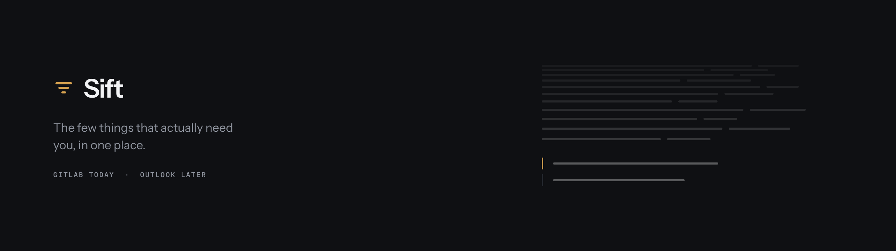

<picture>
  <source media="(prefers-color-scheme: dark)" srcset="docs/banner-dark.png">
  <source media="(prefers-color-scheme: light)" srcset="docs/banner-light.png">
  
</picture>

A quiet notification hub. Sift pulls the things that actually concern you out of a source's
firehose, ranks them, and puts them in one feed you can search properly. GitLab first, with the
seams in place for more sources later.

## Why

GitLab emails you whether or not a change concerns you, and finding anything in that pile
afterwards means fighting your mail client's search. Sift reads GitLab's To-Do list instead,
which is already scoped to you personally, applies your own mute and boost rules on top, and puts
a fuzzy command palette over the result.

## Status

Built and verified:

- accounts: register, sign in, sign out, session persistence
- connecting GitLab from Settings with a personal access token, checked against the live instance
- reading your GitLab to-do list on a schedule, ranked by how much it needs you
- the feed itself, grouped by day, with priority shown as an edge marker rather than a badge
- a visible warning when a token stops working, so an empty list is never mistaken for good news

Not built yet: marking items read, mute and boost rules, the fuzzy command palette, browser
notifications.

## Running it

Docker is the only prerequisite. The Gradle wrapper provisions its own Java 25 toolchain, so
whatever JDK you happen to have does not matter.

```
make up        # builds and runs everything on http://localhost:7777
```

That is the whole setup. It writes a `.env` with a fresh encryption key on first run, waits for
the database to be ready, applies migrations, and serves the app.

To work on it instead, run the pieces separately so both sides reload:

```
make db                      # just postgres
make backend                 # the backend from source, on http://localhost:7777
cd frontend && npm run dev    # vite, on http://localhost:5174
```

`make help` lists the rest. `make logs` follows the app, `make stop` keeps your data, `make clean`
deletes the volume.

## Connecting GitLab

Open **Settings**, put in your instance URL, and Sift shows you a link that opens GitLab's token
page with the name and scope already filled in. Paste the token back and connect.

The token is checked against your instance before it is stored, so a typo fails immediately rather
than quietly never syncing, and a first read happens in the same step so your feed is populated
straight away. After that Sift re-reads every five minutes.

If a token later expires or is revoked, Sift says so on the feed itself rather than just going
quiet, and Settings offers to replace it.

`read_api` is read-only on purpose. Marking a to-do done through the API would need GitLab's full
`api` scope, which is read *and* write across everything you can see, so Sift links out to GitLab
for actions instead.

## Ports

Postgres is published on **5433**, the backend listens on **7777**, and the Vite dev server runs
on **5174**. All three stay clear of 5432, 5173 and the 8080-8090 range that local service stacks
tend to occupy. Override the backend with `SIFT_PORT`.

The dev server proxies `/api` and `/actuator` to the backend, so it shares one origin with the API
and the session cookie and CSRF handshake behave exactly as they do in a built deployment.

## Configuration

Everything lives in `.env`, copied from `.env.example`.

| Variable | Meaning |
| --- | --- |
| `SIFT_ENCRYPTION_KEY` | base64 of 32 random bytes. Required. Changing it makes every stored token undecryptable. |
| `SIFT_ALLOWED_EMAIL_DOMAINS` | Comma separated. Empty lets any address register, which suits a local instance only. |
| `POSTGRES_DB` / `POSTGRES_USER` / `POSTGRES_PASSWORD` | Database credentials. |

## Shape

Sift is a backend-for-frontend. The browser only ever holds a session cookie; source tokens stay
server-side, encrypted, and every call to GitLab is proxied. There is no CORS configuration
anywhere because the API and the bundle are served from one origin.

Tokens are encrypted with AES-GCM before they reach the database, so they are never readable
straight out of it. On a machine only you can reach, that mostly guards against casual snooping and
stray backups; it is the same protection a hosted instance would rely on.

## Look

Near-black in dark, warm off-white in light, with brass as the single accent. Light is designed
rather than inverted. Type is Instrument Sans with IBM Plex Mono for metadata, both self-hosted.

Pick from three states, light, dark, or match system. Dark is the default, your choice is
remembered between visits, and the right theme is in place before the first paint, so the page
never flashes the wrong one at you.
